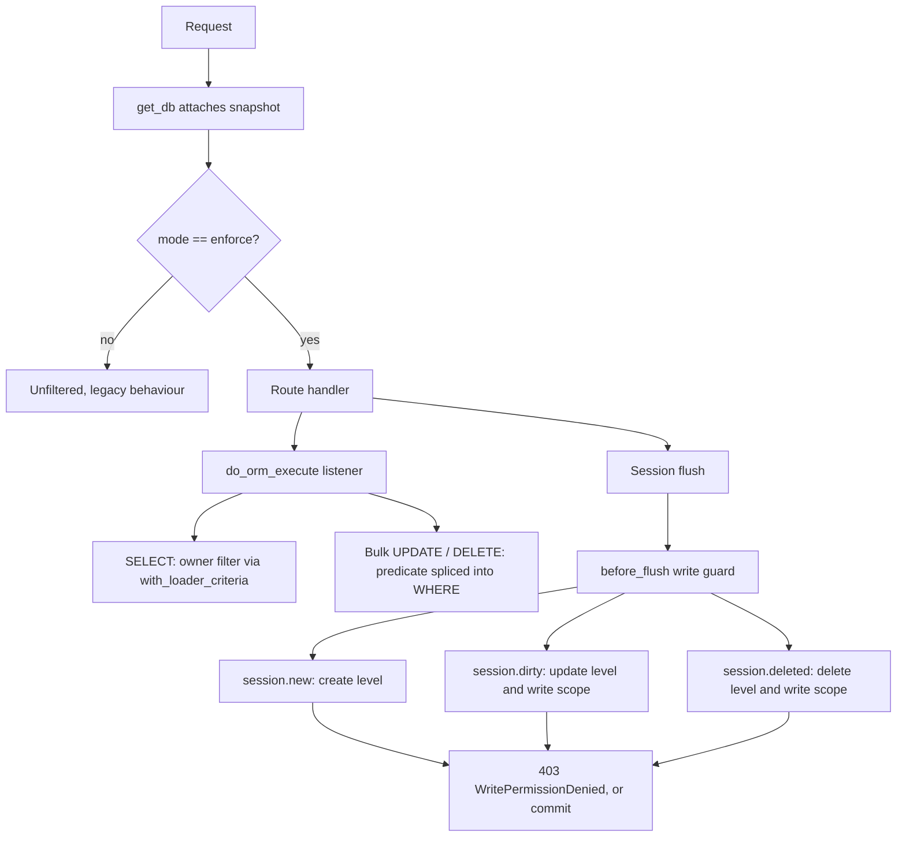

Enforcement is attached to the SQLAlchemy session, not to route handlers.

The reasoning is coverage. The backend has roughly 74 routers and 60 CRUD modules, and a design requiring each one to call a helper would leave whichever ones were missed silently unguarded, with no signal that anything was wrong. A listener sees every query on the session regardless of who wrote the calling code.

Two listeners are needed, because one cannot see everything.



## The statement listener

`session_hooks.do_orm_execute` rewrites statements as they execute. Selects get a `with_loader_criteria` restricting rows to the owner set implied by the grant's scope. Bulk updates and deletes, where loader criteria do not apply, get the predicate spliced directly into the WHERE clause.

Entity detection is the subtle part. Reading `statement.column_descriptions` is the obvious implementation and is wrong for three verified shapes:

```python
query(Deal).count()                     # descriptions empty  -> would leak
select(func.count()).select_from(Deal)  # descriptions empty  -> would leak
query(aliased(Deal))                    # alias not matched   -> would leak
```

Since `.count()` alone appears around 70 times in the CRUD layer, every pagination total would have leaked while list views looked correctly filtered. Detection therefore combines `state.all_mappers` with a recursive walk of the FROM clause, which reaches through the subquery that `Query.count()` wraps around.

A grant of `none` resolves to `false()` rather than to no filter. Fail closed is the default throughout this module.

## The flush guard

The statement listener is structurally blind to unit of work writes. When code calls `db.delete(obj)`, or mutates an attribute and commits, SQLAlchemy composes the resulting SQL itself during flush from the identity map. No statement passes through `do_orm_execute` for the listener to rewrite.

That is not an edge case.

| Idiom | Call sites in `app/Crud` | Seen by statement listener |
| --- | --- | --- |
| `db.delete(obj)` | 85 | No |
| `setattr(obj, ...)` then commit | 70 | No |
| `query(...).update(...)` | 23 | Yes |
| `query(...).delete()` | 21 | Yes |

`write_guard.before_flush` closes this by inspecting `session.new`, `session.dirty` and `session.deleted` before the flush proceeds. Because it reads pending state rather than statements, it covers every object and every idiom without any per-router wiring.

<Warning>
**Original owner, not pending owner.** Updates and deletes are checked against the owner as persisted. Checking the pending value would permit a two step escalation inside one flush: assign `owner_id` to yourself, then modify the record you now appear to own.

Attribute history supplies the previous value when the attribute was loaded before being reassigned. When the instance was expired first, which happens after every commit, the previous value is genuinely absent from memory, so the guard re-reads it by primary key and fails closed if that read does not succeed.
</Warning>

## Router dependencies

`require_object_permission` is applied at router level on the nine objects with meaningful record scoping, alongside the module entitlement guard and deliberately after it, so an unlicensed tenant receives a billing error rather than a permission error.

```python
router = APIRouter(dependencies=[
    Depends(require_module("LEADS")),
    Depends(require_object_permission("leads")),
])
```

It is not the security boundary. The flush guard is. What the dependency adds is rejection before the handler runs, and a precise error payload naming the object, action, required level and granted level. Routers without it are still enforced, they simply produce a less specific refusal.

No per-route action overrides were needed. `ACTION_MIN_LEVEL` assigns create and update the same minimum, so routes whose HTTP method misrepresents intent, such as `POST /leads/{id}/convert`, still resolve correctly. Only delete distinguishes `read_write` from `read_write_delete`.

## Deliberate exemptions

`with_permissions_disabled(session, reason)` is a re-entrant counter with a mandatory reason. It exists for work whose correctness does not depend on the caller: duplicate checks, foreign key validation, aggregate rollups.

A filtered duplicate check silently creates duplicates. A total computed from a filtered subset is wrong data rather than restricted data. Neither failure raises, so neither would be caught by testing.

Authentication is the most important exemption. `get_user_from_token_sub` resolves the acting user inside a bypass, because the record filter cannot decide whether a caller may see a row until it knows who the caller is. Without it, any role holding `users: none`, which is what the seed templates give both non-super roles, filters the caller's own row to `false()` and every authenticated route returns 401 while `/token` and `/verify` continue to succeed.
